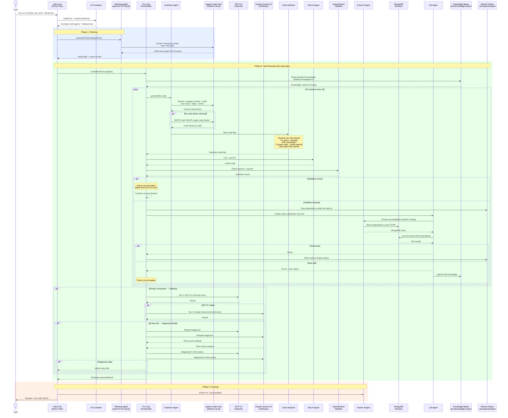
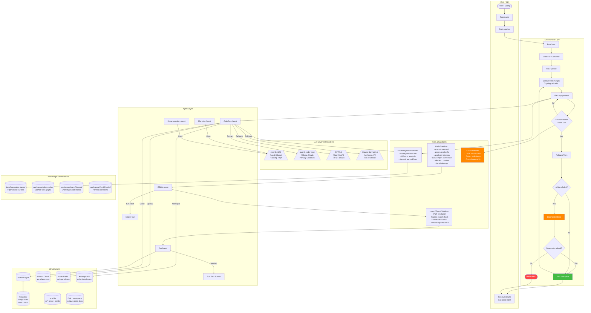
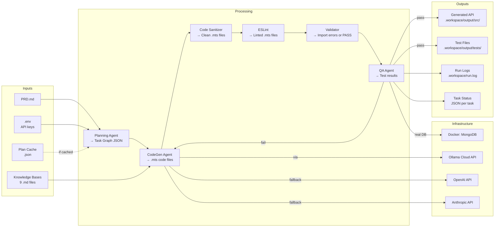

# API Generator Agent — Flow Documentation

## 1. High-Level Pipeline Flowchart

```mermaid
flowchart TB
    START([START: PRD Input]) --> LOAD_ENV[Load .env + Config]
    LOAD_ENV --> INIT_DI[Initialize DI Container]
    INIT_DI --> INIT_TIERS{Fallback Tiers?}
    INIT_TIERS -->|OLLAMA_API_KEY| TIER1[Tier 1: qwen3-coder-next<br/>Ollama Cloud]
    INIT_TIERS -->|OPENAI_API_KEY| TIER2[Tier 2: GPT-5.4<br/>OpenAI]
    INIT_TIERS -->|ANTHROPIC_API_KEY| TIER3[Tier 3: Claude Sonnet 4.6<br/>Anthropic]
    TIER1 & TIER2 & TIER3 --> PLAN

    subgraph Planning["Phase 1: Planning"]
        PLAN{Cached Plan?}
        PLAN -->|Yes| LOAD_PLAN[Load from .plan-cache/]
        PLAN -->|No| GEN_PLAN[/"LLM Call: qwen3.5:27b (local)"\]
        GEN_PLAN --> PARSE_PLAN[Parse JSON Task Graph]
        PARSE_PLAN --> VALIDATE_GRAPH{Valid DAG?}
        VALIDATE_GRAPH -->|No cycle| CACHE_PLAN[Cache plan to disk]
        VALIDATE_GRAPH -->|Cycle detected| FAIL_PLAN([FAIL: Invalid graph])
        LOAD_PLAN --> EXEC
        CACHE_PLAN --> EXEC
    end

    subgraph Execution["Phase 2: Task Execution (Topological Order)"]
        EXEC[Execute Task Graph] --> FOREACH[For each task in dependency order]
        FOREACH --> FIX_LOOP_ENTRY[Enter Fix Loop]
        FIX_LOOP_ENTRY --> SEED_KB[/Seed Knowledge Base<br/>docs/knowledge-bases/taskId-knowledge.md/]
        SEED_KB --> FIX_LOOP
    end

    subgraph FixLoop["Fix Loop (per task, max N iterations)"]
        FIX_LOOP[Start Iteration] --> CODEGEN
        CODEGEN[/"LLM Call: CodeGen Agent<br/>(qwen3-coder-next cloud)"\]
        CODEGEN --> CODE_CHECK{Code blocks<br/>found?}
        CODE_CHECK -->|No| RETRY_CODEGEN[/"RETRY: Same LLM + <br/>'MUST output code blocks'"\]
        RETRY_CODEGEN --> CODE_CHECK2{Code blocks<br/>found?}
        CODE_CHECK2 -->|No| CODEGEN_FAIL[CodeGen Failed]
        CODE_CHECK2 -->|Yes| SANITIZE
        CODE_CHECK -->|Yes| SANITIZE

        SANITIZE[Code Sanitizer<br/>- Strip env.mts imports<br/>- Fix async .resolve<br/>- Convert static to await import<br/>- Add .as plugin<br/>- Replace .derive with .resolve]

        SANITIZE --> ESLINT[/"Tool: ESLint Agent<br/>Auto-fix lint errors"\]
        ESLINT --> IMPORT_VAL{Import Validation<br/>Check paths + exports}
        IMPORT_VAL -->|Errors| FIX_ERRORS[Collect import errors]
        FIX_ERRORS --> CIRCUIT{Circuit Breaker<br/>Same errors 5x?}

        IMPORT_VAL -->|Pass| COPY_DEPS[Copy shared output<br/>into task code dir]
        COPY_DEPS --> DELETE_STALE[Delete stale tests<br/>from code/tests/]
        DELETE_STALE --> DOCKER_MONGO[/"Tool: Docker<br/>Ensure MongoDB running<br/>on port 27018"\]
        DOCKER_MONGO --> QA[/"Tool: QA Agent<br/>bun test against real MongoDB"\]
        QA --> QA_PASS{Tests Pass?}
        QA_PASS -->|Yes| WRITE_OUTPUT[Write to shared output]
        QA_PASS -->|No| QA_ERRORS[Collect QA errors]
        QA_ERRORS --> CIRCUIT

        CIRCUIT -->|Not stuck| NEXT_ITER{More iterations?}
        CIRCUIT -->|STUCK 5x| CIRCUIT_BREAK([CIRCUIT BREAK])
        NEXT_ITER -->|Yes| FIX_LOOP
        NEXT_ITER -->|No| EXHAUSTED([Iterations Exhausted])

        WRITE_OUTPUT --> TASK_PASS([TASK PASSED])
    end

    subgraph Fallback["Fallback System"]
        EXHAUSTED --> FB_TIER2[/"LLM Call: GPT-5.4<br/>16 fresh iterations"\]
        CODEGEN_FAIL --> FB_TIER2
        FB_TIER2 --> FB2_PASS{Passed?}
        FB2_PASS -->|Yes| TASK_PASS2([TASK PASSED via GPT-5.4])
        FB2_PASS -->|No| FB_TIER3[/"LLM Call: Claude Sonnet 4.6<br/>16 fresh iterations"\]
        FB_TIER3 --> FB3_PASS{Passed?}
        FB3_PASS -->|Yes| TASK_PASS3([TASK PASSED via Sonnet])
        FB3_PASS -->|No| DIAGNOSTIC
    end

    subgraph DiagnosticMode["Diagnostic Mode"]
        DIAGNOSTIC[Collect all errors] --> DIAG_CALL[/"LLM Calls: ALL models<br/>Request root cause analysis"\]
        CIRCUIT_BREAK --> DIAGNOSTIC
        DIAG_CALL --> DIAG_SUMMARY[Summarize solutions]
        DIAG_SUMMARY --> DIAG_FIX[/"LLM Fix: 30 cycles per model<br/>with diagnosis context"\]
        DIAG_FIX --> DIAG_PASS{Solved?}
        DIAG_PASS -->|Yes| TASK_PASS4([TASK PASSED via Diagnostic])
        DIAG_PASS -->|No| HARD_FAIL([HARD FAILURE<br/>Exit code 2<br/>"Needs human help"])
    end

    TASK_PASS & TASK_PASS2 & TASK_PASS3 & TASK_PASS4 --> NEXT_TASK{More tasks?}
    NEXT_TASK -->|Yes| FOREACH
    NEXT_TASK -->|No| CLEANUP

    subgraph Cleanup["Phase 3: Cleanup"]
        CLEANUP[Stop MongoDB Docker] --> DOC_GEN[/"LLM Call: Documentation Agent"\]
        DOC_GEN --> RESULTS[Print Results]
        RESULTS --> EXIT_CODE{Hard Failures?}
        EXIT_CODE -->|None| EXIT_0([EXIT 0: Success])
        EXIT_CODE -->|Some failed| EXIT_1([EXIT 1: Partial])
        EXIT_CODE -->|Hard failure| EXIT_2([EXIT 2: Needs Human])
    end

    style HARD_FAIL fill:#ff4444,color:#fff
    style TASK_PASS fill:#44bb44,color:#fff
    style TASK_PASS2 fill:#44bb44,color:#fff
    style TASK_PASS3 fill:#44bb44,color:#fff
    style TASK_PASS4 fill:#44bb44,color:#fff
    style EXIT_0 fill:#44bb44,color:#fff
    style EXIT_2 fill:#ff4444,color:#fff
    style CIRCUIT_BREAK fill:#ff8800,color:#fff
    style DIAGNOSTIC fill:#ff8800,color:#fff
```

---

## 2. Sequence Diagram — Full Pipeline Run



---

## 3. Swimlane Diagram — Component Responsibilities



---

## 4. Data Flow Diagram



---

## 5. Component Inventory

| Component | File | Role | LLM Used | External Deps |
|-----------|------|------|----------|---------------|
| **Entry Point** | `src/index.mts` | CLI, arg parsing, exit codes | - | - |
| **DI Container** | `src/container/di.mts` | Wire all agents + tiers | - | env vars |
| **Planning Agent** | `src/agents/planning-agent.mts` | PRD → task graph | qwen3.5:27b (local) | Ollama |
| **CodeGen Agent** | `src/agents/codegen-agent.mts` | Task → code files | qwen3-coder-next | Ollama Cloud |
| **Code Sanitizer** | `src/agents/codegen-agent.mts` (sanitizeCodeFiles) | Auto-fix LLM mistakes | - | - |
| **ESLint Agent** | `src/agents/eslint-agent.mts` | Lint + auto-fix | - | ESLint CLI |
| **QA Agent** | `src/agents/qa-agent.mts` | Run tests, manage MongoDB | - | Docker, MongoDB, bun test |
| **Import Validator** | `src/validators/import-validator.mts` | Check imports/exports | - | - |
| **Fix Loop** | `src/orchestrator/fix-loop.mts` | Iteration loop + circuit breaker | - | - |
| **Fallback Loop** | `src/orchestrator/fallback-fix-loop.mts` | Multi-tier escalation | GPT-5.4, Sonnet | OpenAI, Anthropic |
| **Diagnostic Fix** | `src/orchestrator/diagnostic-fix.mts` | Last-resort analysis + fix | All 3 models | All 3 APIs |
| **Pipeline** | `src/orchestrator/pipeline.mts` | Top-level orchestrator | - | - |
| **Knowledge Bases** | `docs/knowledge-bases/*.md` | Persistent task-specific hints | - | Filesystem |
| **Plan Cache** | `.workspace/.plan-cache/` | Cached task graphs | - | Filesystem |
| **OpenAI Factory** | `src/llm/openai-factory.mts` | Create ChatOpenAI | - | OpenAI API |
| **Anthropic Factory** | `src/llm/anthropic-factory.mts` | Create ChatAnthropic | - | Anthropic API |
| **Ollama Factory** | `src/llm/ollama-factory.mts` | Create ChatOllama | - | Ollama API |

---

## 6. LLM Call Map

Every LLM call in the system:

| Call Site | Model | Purpose | Avg Duration | Retries |
|-----------|-------|---------|-------------|---------|
| Planning Agent | qwen3.5:27b (local) | PRD → task graph JSON | 50-100s | 1 model |
| CodeGen (generate) | qwen3-coder-next (cloud) | Initial code generation | 10-50s | Tier 1 retry |
| CodeGen (fix) | qwen3-coder-next (cloud) | Fix errors from QA | 15-90s | Tier 1 retry |
| Fallback Tier 2 | GPT-5.4 (OpenAI) | Rescue stuck tasks | 15-40s | 16 iters |
| Fallback Tier 3 | Claude Sonnet 4.6 (Anthropic) | Last model fallback | 10-30s | 16 iters |
| Diagnostic Analysis | All 3 models | Root cause analysis | 20-60s | 1 per model |
| Diagnostic Fix | All 3 models | Fix with diagnosis context | 15-40s | 30 iters each |
| Documentation Agent | qwen3.5:27b (local) | Generate API docs | 30-60s | 1 model |
