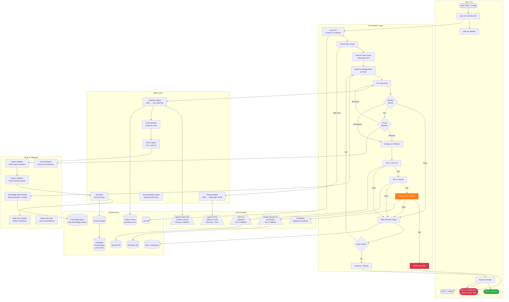

# Swimlane Diagram — Role-Based Workflow

## Diagram Type: Swimlane
Shows responsibilities across 6 lanes: User, Orchestrator, LLM Providers, Agent Layer, Tools/Validators, and Infrastructure.

---

## 1. Mermaid



---

## 2. Draw.io XML

```xml
<mxfile host="app.diagrams.net">
  <diagram name="Swimlane" id="swimlane">
    <mxGraphModel dx="1422" dy="762" grid="1" gridSize="10" guides="1" tooltips="1" connect="1" arrows="1" fold="1" page="1">
      <root>
        <mxCell id="0"/>
        <mxCell id="1" parent="0"/>
        <!-- User Lane -->
        <mxCell id="user_lane" value="User / CLI" style="swimlane;startSize=30;fillColor=#d5e8d4;strokeColor=#82b366;" vertex="1" parent="1">
          <mxGeometry x="0" y="0" width="200" height="800" as="geometry"/>
        </mxCell>
        <mxCell id="u1" value="PRD + Config Input" style="ellipse;fillColor=#d5e8d4;" vertex="1" parent="user_lane">
          <mxGeometry x="25" y="50" width="150" height="40" as="geometry"/>
        </mxCell>
        <mxCell id="u2" value="bun run src/index.mts" style="rounded=1;fillColor=#dae8fc;" vertex="1" parent="user_lane">
          <mxGeometry x="25" y="110" width="150" height="40" as="geometry"/>
        </mxCell>
        <mxCell id="u_exit" value="EXIT 0/1/2" style="ellipse;fillColor=#d5e8d4;" vertex="1" parent="user_lane">
          <mxGeometry x="25" y="720" width="150" height="40" as="geometry"/>
        </mxCell>
        <!-- Orchestrator Lane -->
        <mxCell id="orch_lane" value="Orchestrator" style="swimlane;startSize=30;fillColor=#dae8fc;strokeColor=#6c8ebf;" vertex="1" parent="1">
          <mxGeometry x="220" y="0" width="200" height="800" as="geometry"/>
        </mxCell>
        <mxCell id="o1" value="Load Env + DI" style="rounded=1;fillColor=#dae8fc;" vertex="1" parent="orch_lane">
          <mxGeometry x="20" y="50" width="160" height="35" as="geometry"/>
        </mxCell>
        <mxCell id="o2" value="Check Plan Cache" style="rhombus;fillColor=#fff2cc;" vertex="1" parent="orch_lane">
          <mxGeometry x="30" y="100" width="140" height="60" as="geometry"/>
        </mxCell>
        <mxCell id="o3" value="Execute Tasks&#xa;(topo order)" style="rounded=1;fillColor=#dae8fc;" vertex="1" parent="orch_lane">
          <mxGeometry x="20" y="180" width="160" height="40" as="geometry"/>
        </mxCell>
        <mxCell id="o4" value="Fix Loop" style="rounded=1;fillColor=#dae8fc;" vertex="1" parent="orch_lane">
          <mxGeometry x="20" y="240" width="160" height="35" as="geometry"/>
        </mxCell>
        <mxCell id="o5" value="Circuit Breaker" style="rhombus;fillColor=#fff2cc;" vertex="1" parent="orch_lane">
          <mxGeometry x="30" y="300" width="140" height="60" as="geometry"/>
        </mxCell>
        <mxCell id="o6" value="Fallback Tiers" style="rounded=1;fillColor=#fff2cc;" vertex="1" parent="orch_lane">
          <mxGeometry x="20" y="390" width="160" height="35" as="geometry"/>
        </mxCell>
        <mxCell id="o7" value="Diagnostic Mode" style="rounded=1;fillColor=#f8cecc;" vertex="1" parent="orch_lane">
          <mxGeometry x="20" y="450" width="160" height="35" as="geometry"/>
        </mxCell>
        <mxCell id="o8" value="Write Output" style="rounded=1;fillColor=#d5e8d4;" vertex="1" parent="orch_lane">
          <mxGeometry x="20" y="530" width="160" height="35" as="geometry"/>
        </mxCell>
        <!-- LLM Lane -->
        <mxCell id="llm_lane" value="LLM Providers" style="swimlane;startSize=30;fillColor=#e1d5e7;strokeColor=#9673a6;" vertex="1" parent="1">
          <mxGeometry x="440" y="0" width="200" height="800" as="geometry"/>
        </mxCell>
        <mxCell id="l1" value="qwen3.5:27b&#xa;(Planning)" style="shape=parallelogram;fillColor=#e1d5e7;" vertex="1" parent="llm_lane">
          <mxGeometry x="10" y="100" width="180" height="40" as="geometry"/>
        </mxCell>
        <mxCell id="l2" value="qwen3-coder-next&#xa;(CodeGen)" style="shape=parallelogram;fillColor=#e1d5e7;" vertex="1" parent="llm_lane">
          <mxGeometry x="10" y="240" width="180" height="40" as="geometry"/>
        </mxCell>
        <mxCell id="l3" value="GPT-5.4&#xa;(Tier 2)" style="shape=parallelogram;fillColor=#e1d5e7;" vertex="1" parent="llm_lane">
          <mxGeometry x="10" y="390" width="180" height="40" as="geometry"/>
        </mxCell>
        <mxCell id="l4" value="Claude Sonnet&#xa;(Tier 3)" style="shape=parallelogram;fillColor=#e1d5e7;" vertex="1" parent="llm_lane">
          <mxGeometry x="10" y="450" width="180" height="40" as="geometry"/>
        </mxCell>
        <!-- Tools Lane -->
        <mxCell id="tools_lane" value="Tools &amp; Validators" style="swimlane;startSize=30;fillColor=#fff2cc;strokeColor=#d6b656;" vertex="1" parent="1">
          <mxGeometry x="660" y="0" width="200" height="800" as="geometry"/>
        </mxCell>
        <mxCell id="t1" value="Code Sanitizer" style="rounded=1;fillColor=#fff2cc;" vertex="1" parent="tools_lane">
          <mxGeometry x="20" y="240" width="160" height="30" as="geometry"/>
        </mxCell>
        <mxCell id="t2" value="ESLint" style="rounded=1;fillColor=#fff2cc;" vertex="1" parent="tools_lane">
          <mxGeometry x="20" y="285" width="160" height="30" as="geometry"/>
        </mxCell>
        <mxCell id="t3" value="Import/Export Validator" style="rounded=1;fillColor=#fff2cc;" vertex="1" parent="tools_lane">
          <mxGeometry x="20" y="330" width="160" height="30" as="geometry"/>
        </mxCell>
        <mxCell id="t4" value="Knowledge Base" style="rounded=1;fillColor=#fff2cc;" vertex="1" parent="tools_lane">
          <mxGeometry x="20" y="180" width="160" height="30" as="geometry"/>
        </mxCell>
        <!-- Infra Lane -->
        <mxCell id="infra_lane" value="Infrastructure" style="swimlane;startSize=30;fillColor=#f8cecc;strokeColor=#b85450;" vertex="1" parent="1">
          <mxGeometry x="880" y="0" width="200" height="800" as="geometry"/>
        </mxCell>
        <mxCell id="i1" value="Docker" style="shape=cylinder3;fillColor=#f8cecc;" vertex="1" parent="infra_lane">
          <mxGeometry x="40" y="350" width="120" height="50" as="geometry"/>
        </mxCell>
        <mxCell id="i2" value="MongoDB" style="shape=cylinder3;fillColor=#f8cecc;" vertex="1" parent="infra_lane">
          <mxGeometry x="40" y="420" width="120" height="50" as="geometry"/>
        </mxCell>
        <mxCell id="i3" value=".workspace/" style="shape=cylinder3;fillColor=#f8cecc;" vertex="1" parent="infra_lane">
          <mxGeometry x="40" y="530" width="120" height="50" as="geometry"/>
        </mxCell>
      </root>
    </mxGraphModel>
  </diagram>
</mxfile>
```

---

## 3. Lucidchart Structure

```json
{
  "title": "API Generator Swimlane Diagram",
  "lanes": [
    {
      "id": "user",
      "label": "User / CLI",
      "nodes": [
        {"id": "u_input", "label": "PRD + Config Input", "type": "start"},
        {"id": "u_run", "label": "bun run src/index.mts", "type": "process"},
        {"id": "u_wait", "label": "Wait for pipeline", "type": "process"},
        {"id": "u_exit0", "label": "EXIT 0: Success", "type": "end_success"},
        {"id": "u_exit1", "label": "EXIT 1: Partial", "type": "end_warn"},
        {"id": "u_exit2", "label": "EXIT 2: HARD FAIL", "type": "end_fail"}
      ]
    },
    {
      "id": "orchestrator",
      "label": "Orchestrator Layer",
      "nodes": [
        {"id": "o_env", "label": "Load .env + Create DI", "type": "process"},
        {"id": "o_plan", "label": "Check Plan Cache", "type": "decision"},
        {"id": "o_exec", "label": "Execute Task Graph", "type": "process"},
        {"id": "o_fixloop", "label": "Fix Loop (N iters)", "type": "loop"},
        {"id": "o_circuit", "label": "Circuit Breaker", "type": "decision"},
        {"id": "o_fallback", "label": "Fallback Tiers", "type": "process"},
        {"id": "o_diag", "label": "Diagnostic Mode", "type": "process"},
        {"id": "o_output", "label": "Write Shared Output", "type": "data"},
        {"id": "o_cleanup", "label": "Cleanup + Results", "type": "process"},
        {"id": "o_hardfail", "label": "HARD FAILURE", "type": "end_fail"}
      ]
    },
    {
      "id": "llm",
      "label": "LLM Providers",
      "nodes": [
        {"id": "l_qwen_local", "label": "qwen3.5:27b (local)", "type": "llm"},
        {"id": "l_qwen_cloud", "label": "qwen3-coder-next (cloud)", "type": "llm"},
        {"id": "l_gpt", "label": "GPT-5.4 (OpenAI)", "type": "llm"},
        {"id": "l_sonnet", "label": "Claude Sonnet 4.6 (Anthropic)", "type": "llm"}
      ]
    },
    {
      "id": "agents",
      "label": "Agent Layer",
      "nodes": [
        {"id": "a_plan", "label": "Planning Agent", "type": "agent"},
        {"id": "a_codegen", "label": "CodeGen Agent", "type": "agent"},
        {"id": "a_eslint", "label": "ESLint Agent", "type": "agent"},
        {"id": "a_qa", "label": "QA Agent", "type": "agent"},
        {"id": "a_sanitizer", "label": "Code Sanitizer", "type": "tool"}
      ]
    },
    {
      "id": "tools",
      "label": "Tools & Validators",
      "nodes": [
        {"id": "t_import", "label": "Import Validator", "type": "validator"},
        {"id": "t_export", "label": "Export Validator", "type": "validator"},
        {"id": "t_kb", "label": "Knowledge Base Seeder", "type": "data"},
        {"id": "t_circuit", "label": "Circuit Breaker", "type": "guard"},
        {"id": "t_stale", "label": "Stale Test Cleaner", "type": "tool"}
      ]
    },
    {
      "id": "infra",
      "label": "Infrastructure",
      "nodes": [
        {"id": "i_docker", "label": "Docker Engine", "type": "infra"},
        {"id": "i_mongo", "label": "MongoDB (port 27018)", "type": "database"},
        {"id": "i_ollama", "label": "Ollama Cloud API", "type": "api"},
        {"id": "i_openai", "label": "OpenAI API", "type": "api"},
        {"id": "i_anthropic", "label": "Anthropic API", "type": "api"},
        {"id": "i_disk", "label": ".workspace/", "type": "storage"}
      ]
    }
  ],
  "cross_lane_edges": [
    {"from": "u_run", "to": "o_env"},
    {"from": "o_plan", "to": "a_plan", "label": "Cache miss"},
    {"from": "a_plan", "to": "l_qwen_local"},
    {"from": "o_fixloop", "to": "a_codegen"},
    {"from": "a_codegen", "to": "l_qwen_cloud"},
    {"from": "a_codegen", "to": "a_sanitizer"},
    {"from": "a_sanitizer", "to": "a_eslint"},
    {"from": "a_eslint", "to": "t_import"},
    {"from": "t_import", "to": "a_qa", "label": "Pass"},
    {"from": "a_qa", "to": "i_docker"},
    {"from": "i_docker", "to": "i_mongo"},
    {"from": "o_fallback", "to": "l_gpt", "label": "Tier 2"},
    {"from": "o_fallback", "to": "l_sonnet", "label": "Tier 3"},
    {"from": "l_qwen_cloud", "to": "i_ollama"},
    {"from": "l_gpt", "to": "i_openai"},
    {"from": "l_sonnet", "to": "i_anthropic"},
    {"from": "o_output", "to": "i_disk"},
    {"from": "o_cleanup", "to": "u_exit0"},
    {"from": "o_hardfail", "to": "u_exit2"}
  ]
}
```

---

## 4. Visio Structure (CSV)

```csv
id,name,shape,lane,connects_to,connection_label
u_input,PRD + Config Input,oval,User,u_run,
u_run,bun run src/index.mts,rectangle,User,o_env,
u_exit0,EXIT 0: Success,oval,User,,
u_exit1,EXIT 1: Partial,oval,User,,
u_exit2,EXIT 2: HARD FAIL,oval,User,,
o_env,Load .env + DI Container,rectangle,Orchestrator,o_plan,
o_plan,Check Plan Cache?,diamond,Orchestrator,a_plan;o_exec,Miss;Hit
o_exec,Execute Task Graph (topo),rectangle,Orchestrator,o_fixloop,
o_fixloop,Fix Loop (N iterations),rectangle,Orchestrator,o_circuit;o_output,Fail;Pass
o_circuit,Circuit Breaker: Stuck 5x?,diamond,Orchestrator,o_fixloop;o_fallback,No;Yes
o_fallback,Fallback: GPT-5.4 then Sonnet,rectangle,Orchestrator,o_output;o_diag,Pass;Fail
o_diag,Diagnostic Mode (30 cycles),rectangle,Orchestrator,o_output;o_hardfail,Solved;Failed
o_hardfail,HARD FAILURE,oval,Orchestrator,u_exit2,
o_output,Write Shared Output,cylinder,Orchestrator,o_exec;o_cleanup,Next task;Done
o_cleanup,Cleanup + Results,rectangle,Orchestrator,u_exit0;u_exit1,
l_local,qwen3.5:27b (local),parallelogram,LLM Providers,,Planning
l_cloud,qwen3-coder-next (cloud),parallelogram,LLM Providers,,Primary CodeGen
l_gpt,GPT-5.4 (OpenAI),parallelogram,LLM Providers,,Tier 2
l_sonnet,Claude Sonnet 4.6 (Anthropic),parallelogram,LLM Providers,,Tier 3
a_plan,Planning Agent,rectangle,Agents,l_local,
a_codegen,CodeGen Agent,rectangle,Agents,l_cloud,
a_sanitizer,Code Sanitizer (6 rules),rectangle,Agents,a_eslint,
a_eslint,ESLint Agent,rectangle,Agents,t_import,
a_qa,QA Agent,rectangle,Agents,i_docker,
t_import,Import/Export Validator,rectangle,Tools,a_qa;o_circuit,Pass;Errors
t_kb,Knowledge Base Seeder,document,Tools,o_fixloop,
t_circuit,Circuit Breaker Logic,diamond,Tools,o_fallback,
i_docker,Docker Engine,cylinder,Infrastructure,i_mongo,
i_mongo,MongoDB port 27018,cylinder,Infrastructure,,
i_ollama,Ollama Cloud API,cloud,Infrastructure,,
i_openai,OpenAI API,cloud,Infrastructure,,
i_anthropic,Anthropic API,cloud,Infrastructure,,
i_disk,.workspace/ output,cylinder,Infrastructure,,
```

---

## 5. Explanation

The swimlane diagram shows how work flows across 6 responsibility domains:

- **User/CLI**: Provides input, receives results and exit codes
- **Orchestrator**: Manages task execution order, fix loops, circuit breaker, fallback escalation, and diagnostic mode
- **LLM Providers**: 4 models across 3 providers — local qwen for planning, cloud qwen for primary codegen, GPT-5.4 and Sonnet for fallbacks
- **Agent Layer**: Specialized agents handle planning, code generation, linting, QA testing, and code sanitization
- **Tools/Validators**: Import/export validation, knowledge base seeding, circuit breaker tracking, stale file cleanup
- **Infrastructure**: Docker for MongoDB, cloud APIs for LLMs, disk for workspace and knowledge bases
