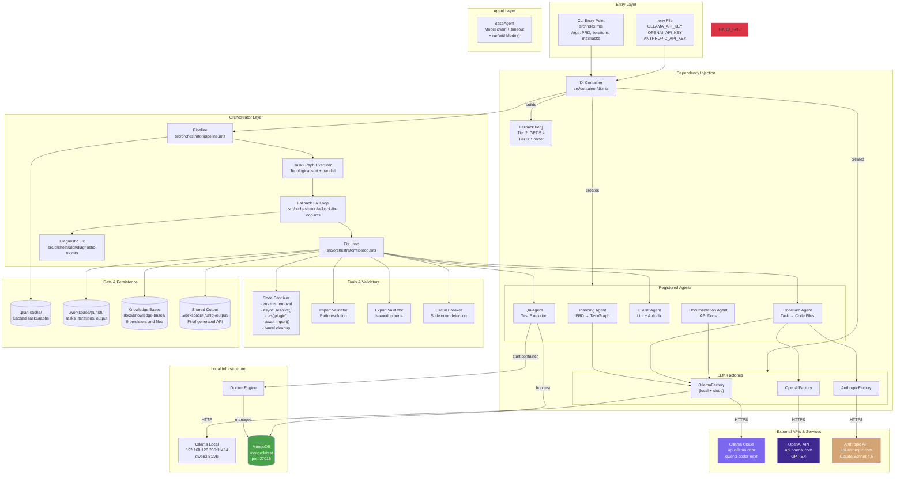

# System Architecture Diagram

## Diagram Type: Architecture
Shows the layered system architecture with all components, external integrations, data stores, and communication patterns.

---

## 1. Mermaid



---

## 2. Draw.io XML

```xml
<mxfile host="app.diagrams.net">
  <diagram name="Architecture" id="arch">
    <mxGraphModel dx="1422" dy="900" grid="1" gridSize="10" guides="1">
      <root>
        <mxCell id="0"/>
        <mxCell id="1" parent="0"/>
        <!-- External APIs -->
        <mxCell id="ext" value="External APIs" style="swimlane;startSize=25;fillColor=#f5f5f5;strokeColor=#666;dashed=1;" vertex="1" parent="1">
          <mxGeometry x="50" y="10" width="800" height="90" as="geometry"/>
        </mxCell>
        <mxCell id="ollama_c" value="Ollama Cloud&#xa;qwen3-coder-next" style="shape=cloud;fillColor=#7B68EE;fontColor=#fff;" vertex="1" parent="ext">
          <mxGeometry x="20" y="30" width="160" height="50" as="geometry"/>
        </mxCell>
        <mxCell id="openai" value="OpenAI&#xa;GPT-5.4" style="shape=cloud;fillColor=#412991;fontColor=#fff;" vertex="1" parent="ext">
          <mxGeometry x="220" y="30" width="160" height="50" as="geometry"/>
        </mxCell>
        <mxCell id="anthropic" value="Anthropic&#xa;Claude Sonnet 4.6" style="shape=cloud;fillColor=#D4A574;fontColor=#fff;" vertex="1" parent="ext">
          <mxGeometry x="420" y="30" width="160" height="50" as="geometry"/>
        </mxCell>
        <mxCell id="ollama_l" value="Ollama Local&#xa;qwen3.5:27b" style="shape=cloud;fillColor=#82b366;fontColor=#fff;" vertex="1" parent="ext">
          <mxGeometry x="620" y="30" width="160" height="50" as="geometry"/>
        </mxCell>
        <!-- Entry -->
        <mxCell id="entry" value="Entry Layer" style="swimlane;startSize=25;fillColor=#d5e8d4;" vertex="1" parent="1">
          <mxGeometry x="50" y="120" width="800" height="70" as="geometry"/>
        </mxCell>
        <mxCell id="cli" value="CLI (index.mts)" style="rounded=1;fillColor=#d5e8d4;" vertex="1" parent="entry">
          <mxGeometry x="20" y="30" width="150" height="30" as="geometry"/>
        </mxCell>
        <mxCell id="env" value=".env (API Keys)" style="shape=document;fillColor=#d5e8d4;" vertex="1" parent="entry">
          <mxGeometry x="200" y="25" width="130" height="35" as="geometry"/>
        </mxCell>
        <mxCell id="dibox" value="DI Container" style="rounded=1;fillColor=#d5e8d4;" vertex="1" parent="entry">
          <mxGeometry x="370" y="30" width="150" height="30" as="geometry"/>
        </mxCell>
        <!-- Orchestrator -->
        <mxCell id="orch" value="Orchestrator Layer" style="swimlane;startSize=25;fillColor=#dae8fc;" vertex="1" parent="1">
          <mxGeometry x="50" y="210" width="800" height="90" as="geometry"/>
        </mxCell>
        <mxCell id="pipeline" value="Pipeline" style="rounded=1;fillColor=#dae8fc;" vertex="1" parent="orch">
          <mxGeometry x="20" y="35" width="120" height="30" as="geometry"/>
        </mxCell>
        <mxCell id="fixloop" value="Fix Loop" style="rounded=1;fillColor=#dae8fc;" vertex="1" parent="orch">
          <mxGeometry x="170" y="35" width="120" height="30" as="geometry"/>
        </mxCell>
        <mxCell id="fallback" value="Fallback Loop" style="rounded=1;fillColor=#dae8fc;" vertex="1" parent="orch">
          <mxGeometry x="320" y="35" width="120" height="30" as="geometry"/>
        </mxCell>
        <mxCell id="diagbox" value="Diagnostic Fix" style="rounded=1;fillColor=#f8cecc;" vertex="1" parent="orch">
          <mxGeometry x="470" y="35" width="120" height="30" as="geometry"/>
        </mxCell>
        <mxCell id="graphbox" value="Task Graph Executor" style="rounded=1;fillColor=#dae8fc;" vertex="1" parent="orch">
          <mxGeometry x="620" y="35" width="150" height="30" as="geometry"/>
        </mxCell>
        <!-- Agents -->
        <mxCell id="agents" value="Agent Layer" style="swimlane;startSize=25;fillColor=#e1d5e7;" vertex="1" parent="1">
          <mxGeometry x="50" y="320" width="800" height="90" as="geometry"/>
        </mxCell>
        <mxCell id="pa" value="Planning" style="rounded=1;fillColor=#e1d5e7;" vertex="1" parent="agents">
          <mxGeometry x="20" y="35" width="100" height="30" as="geometry"/>
        </mxCell>
        <mxCell id="ca" value="CodeGen" style="rounded=1;fillColor=#e1d5e7;" vertex="1" parent="agents">
          <mxGeometry x="140" y="35" width="100" height="30" as="geometry"/>
        </mxCell>
        <mxCell id="ea" value="ESLint" style="rounded=1;fillColor=#e1d5e7;" vertex="1" parent="agents">
          <mxGeometry x="260" y="35" width="100" height="30" as="geometry"/>
        </mxCell>
        <mxCell id="qabox" value="QA" style="rounded=1;fillColor=#e1d5e7;" vertex="1" parent="agents">
          <mxGeometry x="380" y="35" width="100" height="30" as="geometry"/>
        </mxCell>
        <mxCell id="sanbox" value="Sanitizer" style="rounded=1;fillColor=#e1d5e7;" vertex="1" parent="agents">
          <mxGeometry x="500" y="35" width="100" height="30" as="geometry"/>
        </mxCell>
        <mxCell id="docsbox" value="Docs" style="rounded=1;fillColor=#e1d5e7;" vertex="1" parent="agents">
          <mxGeometry x="620" y="35" width="100" height="30" as="geometry"/>
        </mxCell>
        <!-- Tools -->
        <mxCell id="tools" value="Tools &amp; Validators" style="swimlane;startSize=25;fillColor=#fff2cc;" vertex="1" parent="1">
          <mxGeometry x="50" y="430" width="800" height="70" as="geometry"/>
        </mxCell>
        <mxCell id="importv" value="Import Validator" style="rounded=1;fillColor=#fff2cc;" vertex="1" parent="tools">
          <mxGeometry x="20" y="30" width="130" height="25" as="geometry"/>
        </mxCell>
        <mxCell id="exportv" value="Export Validator" style="rounded=1;fillColor=#fff2cc;" vertex="1" parent="tools">
          <mxGeometry x="170" y="30" width="130" height="25" as="geometry"/>
        </mxCell>
        <mxCell id="cbbox" value="Circuit Breaker" style="rounded=1;fillColor=#fff2cc;" vertex="1" parent="tools">
          <mxGeometry x="320" y="30" width="130" height="25" as="geometry"/>
        </mxCell>
        <mxCell id="kbbox" value="KB Seeder" style="rounded=1;fillColor=#fff2cc;" vertex="1" parent="tools">
          <mxGeometry x="470" y="30" width="130" height="25" as="geometry"/>
        </mxCell>
        <mxCell id="stalebox" value="Stale Cleaner" style="rounded=1;fillColor=#fff2cc;" vertex="1" parent="tools">
          <mxGeometry x="620" y="30" width="130" height="25" as="geometry"/>
        </mxCell>
        <!-- Data -->
        <mxCell id="data" value="Data &amp; Persistence" style="swimlane;startSize=25;fillColor=#f8cecc;" vertex="1" parent="1">
          <mxGeometry x="50" y="520" width="800" height="80" as="geometry"/>
        </mxCell>
        <mxCell id="kbdata" value="Knowledge Bases&#xa;(9 .md files)" style="shape=cylinder3;fillColor=#f8cecc;" vertex="1" parent="data">
          <mxGeometry x="20" y="25" width="130" height="45" as="geometry"/>
        </mxCell>
        <mxCell id="plancache" value="Plan Cache&#xa;(.json)" style="shape=cylinder3;fillColor=#f8cecc;" vertex="1" parent="data">
          <mxGeometry x="170" y="25" width="130" height="45" as="geometry"/>
        </mxCell>
        <mxCell id="wsdata" value="Workspace&#xa;(tasks, iters)" style="shape=cylinder3;fillColor=#f8cecc;" vertex="1" parent="data">
          <mxGeometry x="320" y="25" width="130" height="45" as="geometry"/>
        </mxCell>
        <mxCell id="outputdata" value="Shared Output&#xa;(final API)" style="shape=cylinder3;fillColor=#f8cecc;" vertex="1" parent="data">
          <mxGeometry x="470" y="25" width="130" height="45" as="geometry"/>
        </mxCell>
        <mxCell id="mongodata" value="MongoDB&#xa;(Docker 27018)" style="shape=cylinder3;fillColor=#47A248;fontColor=#fff;" vertex="1" parent="data">
          <mxGeometry x="620" y="25" width="130" height="45" as="geometry"/>
        </mxCell>
      </root>
    </mxGraphModel>
  </diagram>
</mxfile>
```

---

## 3. Lucidchart Structure

```json
{
  "title": "API Generator System Architecture",
  "layers": [
    {
      "id": "external",
      "label": "External APIs & Services",
      "position": "top",
      "nodes": [
        {"id": "ollama_cloud", "label": "Ollama Cloud\nqwen3-coder-next", "type": "cloud_service", "protocol": "HTTPS"},
        {"id": "openai_api", "label": "OpenAI API\nGPT-5.4", "type": "cloud_service", "protocol": "HTTPS"},
        {"id": "anthropic_api", "label": "Anthropic API\nClaude Sonnet 4.6", "type": "cloud_service", "protocol": "HTTPS"},
        {"id": "ollama_local", "label": "Ollama Local\nqwen3.5:27b", "type": "local_service", "protocol": "HTTP"}
      ]
    },
    {
      "id": "entry",
      "label": "Entry Layer",
      "nodes": [
        {"id": "cli", "label": "CLI (index.mts)", "type": "entry_point"},
        {"id": "env", "label": ".env (API Keys + Config)", "type": "config"},
        {"id": "di", "label": "DI Container", "type": "container"}
      ]
    },
    {
      "id": "orchestrator",
      "label": "Orchestrator Layer",
      "nodes": [
        {"id": "pipeline", "label": "Pipeline", "type": "orchestrator"},
        {"id": "fix_loop", "label": "Fix Loop", "type": "orchestrator"},
        {"id": "fallback_loop", "label": "Fallback Loop", "type": "orchestrator"},
        {"id": "diagnostic", "label": "Diagnostic Fix", "type": "orchestrator"},
        {"id": "graph_executor", "label": "Task Graph Executor", "type": "orchestrator"}
      ]
    },
    {
      "id": "agents",
      "label": "Agent Layer",
      "nodes": [
        {"id": "planning_agent", "label": "Planning Agent", "type": "agent", "llm": "qwen3.5:27b"},
        {"id": "codegen_agent", "label": "CodeGen Agent", "type": "agent", "llm": "qwen3-coder-next + fallbacks"},
        {"id": "eslint_agent", "label": "ESLint Agent", "type": "agent", "llm": "none"},
        {"id": "qa_agent", "label": "QA Agent", "type": "agent", "llm": "none"},
        {"id": "sanitizer", "label": "Code Sanitizer", "type": "tool", "rules": 6},
        {"id": "doc_agent", "label": "Documentation Agent", "type": "agent", "llm": "qwen3.5:27b"}
      ]
    },
    {
      "id": "tools",
      "label": "Tools & Validators",
      "nodes": [
        {"id": "import_validator", "label": "Import Validator", "type": "validator"},
        {"id": "export_validator", "label": "Export Validator", "type": "validator"},
        {"id": "circuit_breaker", "label": "Circuit Breaker", "type": "guard"},
        {"id": "kb_seeder", "label": "Knowledge Base Seeder", "type": "tool"},
        {"id": "stale_cleaner", "label": "Stale Test Cleaner", "type": "tool"}
      ]
    },
    {
      "id": "data",
      "label": "Data & Persistence",
      "position": "bottom",
      "nodes": [
        {"id": "knowledge_bases", "label": "Knowledge Bases (9 files)", "type": "file_storage"},
        {"id": "plan_cache", "label": "Plan Cache", "type": "file_storage"},
        {"id": "workspace", "label": "Workspace (tasks + iters)", "type": "file_storage"},
        {"id": "shared_output", "label": "Shared Output (final API)", "type": "file_storage"},
        {"id": "mongodb", "label": "MongoDB (Docker 27018)", "type": "database"}
      ]
    }
  ],
  "connections": [
    {"from": "cli", "to": "di", "type": "sync"},
    {"from": "di", "to": "pipeline", "type": "sync"},
    {"from": "pipeline", "to": "graph_executor", "type": "sync"},
    {"from": "graph_executor", "to": "fallback_loop", "type": "sync", "label": "per task"},
    {"from": "fallback_loop", "to": "fix_loop", "type": "sync"},
    {"from": "fallback_loop", "to": "diagnostic", "type": "sync", "label": "all tiers failed"},
    {"from": "fix_loop", "to": "codegen_agent", "type": "sync"},
    {"from": "codegen_agent", "to": "ollama_cloud", "type": "async", "label": "streaming"},
    {"from": "codegen_agent", "to": "openai_api", "type": "async", "label": "fallback"},
    {"from": "codegen_agent", "to": "anthropic_api", "type": "async", "label": "fallback"},
    {"from": "fix_loop", "to": "eslint_agent", "type": "sync"},
    {"from": "fix_loop", "to": "import_validator", "type": "sync"},
    {"from": "fix_loop", "to": "qa_agent", "type": "sync"},
    {"from": "qa_agent", "to": "mongodb", "type": "sync", "label": "bun test"},
    {"from": "fix_loop", "to": "circuit_breaker", "type": "sync"},
    {"from": "fix_loop", "to": "shared_output", "type": "sync", "label": "on pass"},
    {"from": "planning_agent", "to": "ollama_local", "type": "async", "label": "streaming"}
  ]
}
```

---

## 4. Visio Structure (CSV)

```csv
id,name,type,layer,shape,connects_to,protocol
ollama_cloud,Ollama Cloud (qwen3-coder-next),cloud_api,External,cloud,codegen_agent,HTTPS
openai_api,OpenAI API (GPT-5.4),cloud_api,External,cloud,codegen_agent,HTTPS
anthropic_api,Anthropic API (Claude Sonnet),cloud_api,External,cloud,codegen_agent,HTTPS
ollama_local,Ollama Local (qwen3.5:27b),local_api,External,cloud,planning_agent;doc_agent,HTTP
cli,CLI Entry Point (index.mts),entry,Entry,rectangle,di_container,
env_file,.env (API Keys),config,Entry,document,di_container,
di_container,DI Container,container,Entry,rectangle,pipeline,
pipeline,Pipeline Orchestrator,orchestrator,Orchestrator,rectangle,graph_executor,
graph_executor,Task Graph Executor,orchestrator,Orchestrator,rectangle,fallback_loop,
fallback_loop,Fallback Fix Loop,orchestrator,Orchestrator,rectangle,fix_loop;diagnostic,
fix_loop,Fix Loop,orchestrator,Orchestrator,rectangle,codegen_agent;eslint_agent;qa_agent,
diagnostic,Diagnostic Fix,orchestrator,Orchestrator,rectangle,codegen_agent,
planning_agent,Planning Agent,agent,Agents,rectangle,ollama_local,
codegen_agent,CodeGen Agent,agent,Agents,rectangle,ollama_cloud;openai_api;anthropic_api,
eslint_agent,ESLint Agent,agent,Agents,rectangle,,
qa_agent,QA Agent,agent,Agents,rectangle,docker_mongodb,
sanitizer,Code Sanitizer,tool,Agents,rectangle,,
doc_agent,Documentation Agent,agent,Agents,rectangle,ollama_local,
import_validator,Import Validator,validator,Tools,rectangle,,
export_validator,Export Validator,validator,Tools,rectangle,,
circuit_breaker,Circuit Breaker,guard,Tools,diamond,,
kb_seeder,Knowledge Base Seeder,tool,Tools,rectangle,knowledge_bases,
stale_cleaner,Stale Test Cleaner,tool,Tools,rectangle,,
knowledge_bases,Knowledge Bases (9 .md),file_store,Data,cylinder,,
plan_cache,Plan Cache (.json),file_store,Data,cylinder,,
workspace,Workspace (tasks + iterations),file_store,Data,cylinder,,
shared_output,Shared Output (final API),file_store,Data,cylinder,,
docker_mongodb,MongoDB (Docker 27018),database,Data,cylinder,,
```

---

## 5. Explanation

The architecture is organized in 6 horizontal layers:

1. **External APIs**: 3 cloud LLM providers (Ollama, OpenAI, Anthropic) + 1 local Ollama instance
2. **Entry Layer**: CLI entry point, environment config, DI container that wires everything
3. **Orchestrator Layer**: Pipeline → Task Graph Executor → Fallback Fix Loop → Fix Loop → Diagnostic Fix
4. **Agent Layer**: 5 specialized agents + code sanitizer, each with a single responsibility
5. **Tools & Validators**: Import/export validation, circuit breaker, knowledge base seeding, stale file cleanup
6. **Data & Persistence**: Knowledge bases, plan cache, workspace, shared output, MongoDB (Docker)

Key architectural patterns:
- **Dependency injection**: All agents and factories wired via DI container
- **Chain of responsibility**: Fix Loop → Fallback → Diagnostic is a chain where each level handles what the previous couldn't
- **Strategy pattern**: LLM factories abstract provider differences behind `BaseChatModel` interface
- **Observer**: Circuit breaker monitors error counts across iterations

## 6. Recommendations

- Add an **API gateway** layer if the agent will be exposed as a service
- Consider **Redis** for distributed plan caching across multiple pipeline instances
- Add **cost tracking middleware** in the LLM factory layer to monitor spend per run
- Implement **webhook notifications** on hard failure for ops alerting
